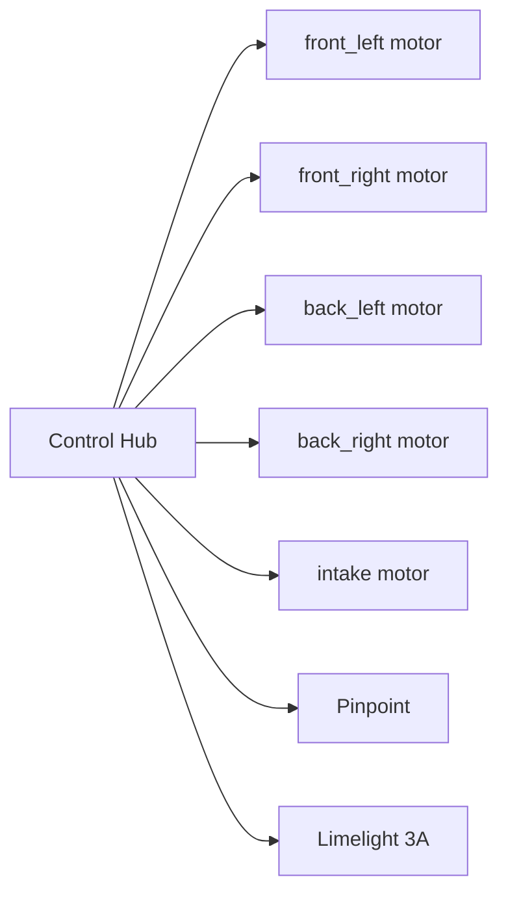

# Wiring Diagram (text/mermaid)

```mermaid
graph LR
    CH[Control Hub] --> M0[front_left motor]
    CH --> M1[front_right motor]
    CH --> M2[back_left motor]
    CH --> M3[back_right motor]
    CH --> M4[intake motor]
    CH --> I2C0[Pinpoint]
    CH --> USB0[Limelight 3A]
```
